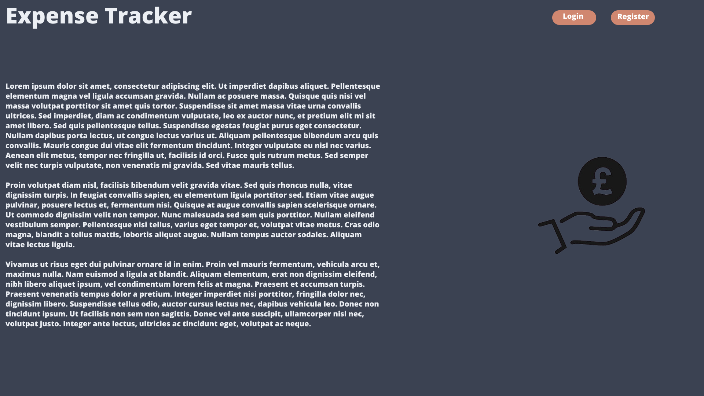
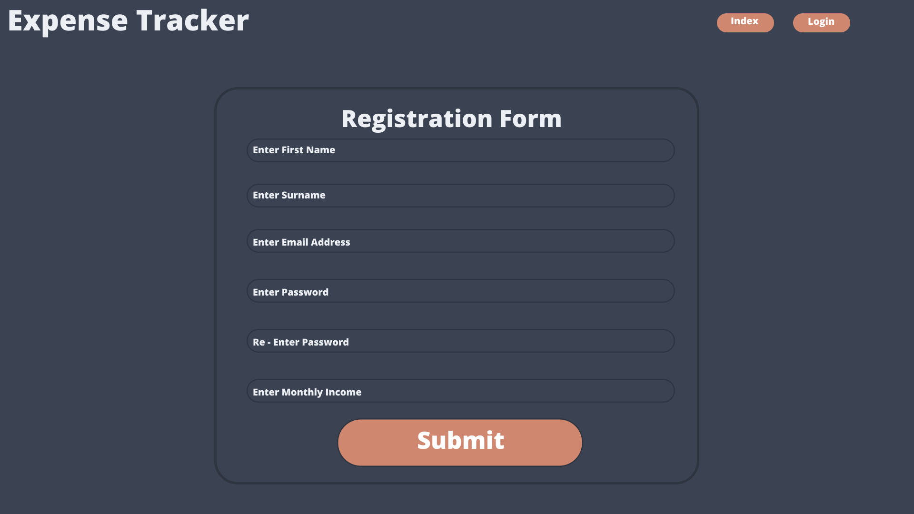
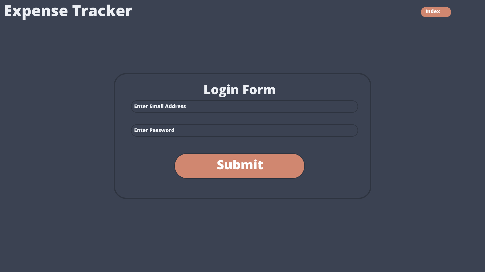
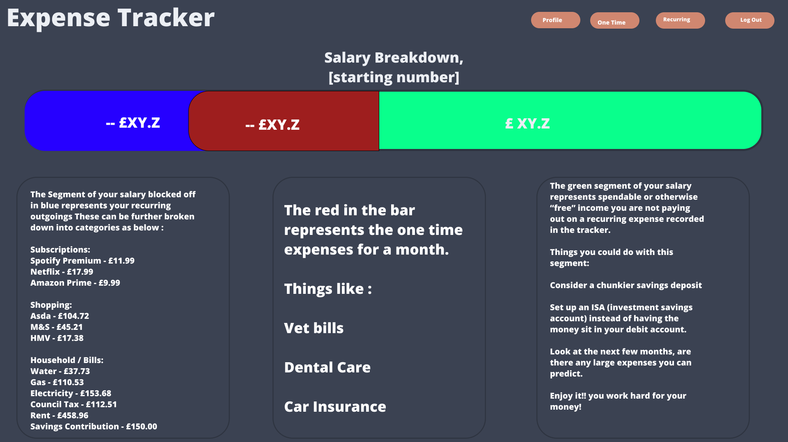
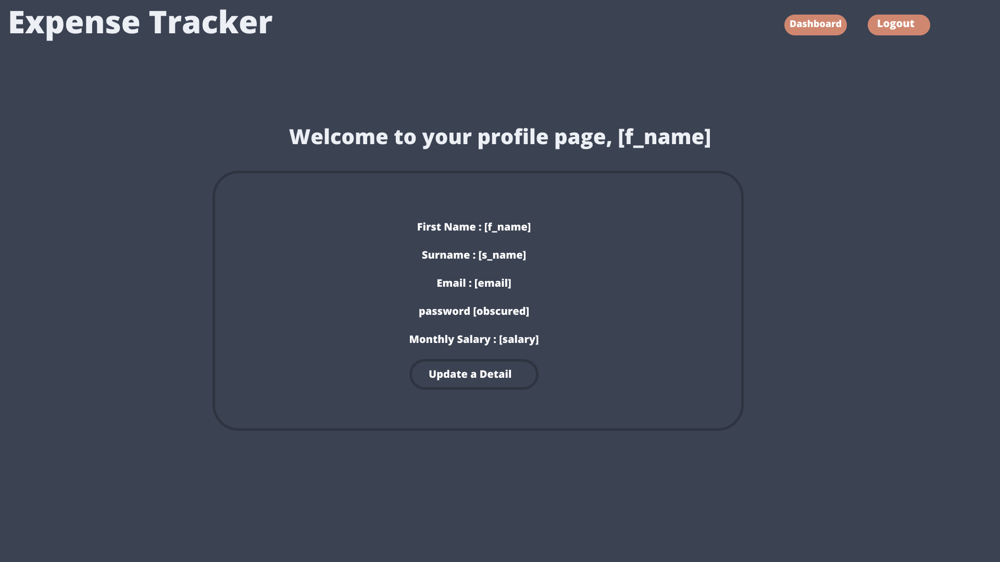
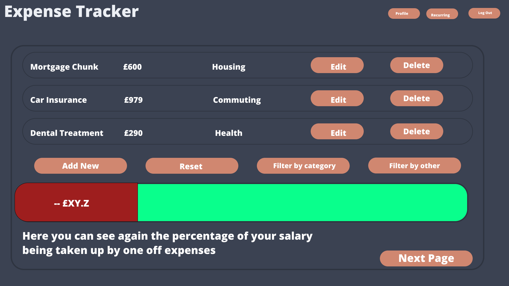
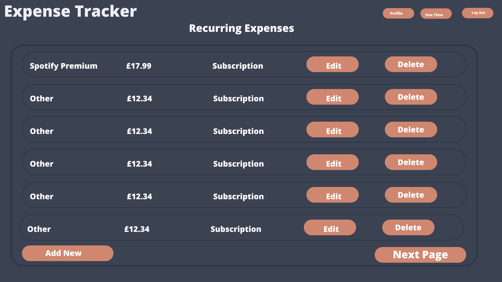
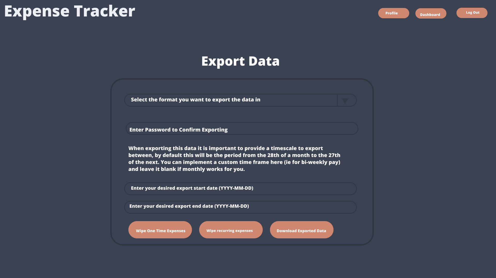

# 💸 Expense Tracker Documentation

## 🔗 Links

See my Designs as I'm building live:  
[View Figma Design](https://www.figma.com/design/5J1Ooa5tWvulwibQokN1WE/Expense-Tracker?node-id=1-2&t=Cd9KEJPqNkOuRclt-1)  
You're already in my repo... not linking that.

---

## 📝 Commit Message Prefixes

To keep commit history clean, readable, and consistent, I will use the following prefixes in commit messages. 

| Prefix     | Description                                                 |
|------------|-------------------------------------------------------------|
| `feat`     | A new feature                                               |
| `fix`      | A bug fix                                                   |
| `docs`     | Documentation only changes                                  |
| `style`    | Code style changes (formatting, missing semicolons, etc.)  |
| `refactor` | Code changes that neither fix bugs nor add features        |
| `test`     | Adding or updating tests                                    |
| `chore`    | Maintenance tasks (build system, tooling, etc.)            |
| `revert`   | Reverts a previous commit                                   |

---

# 🧠 Context

Purely a project intended for personal use — I've found that often I'm getting paid and having very little tracking of my finances.  
Being 18, obviously I'm not perfect at managing my money. Usually, I'll have some cool hobby-related items to buy on payday.

Then it's a scroll through Amazon at a few things I've been eyeing for a while... next I know, I've spent a lot more than I had originally intended to.  
Couple that with social outings and suddenly that minimum wage part-time jewellery shop wage is looking a lot more like that one crumpled note in that one pair of jeans you just can't be bothered to empty the pockets of (especially because it's stuck in that stupid little hole inside your right-hand pocket!)

So anyway — I thought why not use my knowledge of PHP from my T Level and put it to some good use building myself a semi-intelligent spending tracker while also making a portfolio piece out of it.

Hence why some of the features won't actually be much use for me. See the designs where I talk about household bills... Thankfully my parents deal with all that!  
But I know for literally everyone in the adult world who isn't filthy rich, budgeting isn't just useful — it's a genuine **NEED**.

**Triple whammy**:  
✅ Keeps me sharp (Not C sharp tho)  
✅ Makes a great portfolio piece  
✅ Could genuinely help people get by in the new world

---

## 🖼️ Design

### 👀 The Design: What You’re Looking At

Check out the [Figma file](https://www.figma.com/design/5J1Ooa5tWvulwibQokN1WE/Expense-Tracker?node-id=1-2&t=Cd9KEJPqNkOuRclt-1) — you’ll see a bunch of screens like:

- **Dashboard** – snapshot of your money habits
- **Add Expense** – because you *need* to log that overpriced coffee
- **Monthly Summary** – graphs make overspending look fancy
- **Budget Setup** – for those adulting harder than me

---

# 📤 The Goods from Figma

## index.php

The Index page. You know the drill, right? That dazzling first impression – usually a logo that cost way too much and a wall of text promising the Earth. Surprise! This one's no different. We've got some sort of logo up there (probably looks quite nice, to be fair) and a load of text explaining how this Expense Tracker is going to revolutionise your life. It'll probably mention things like "seamless integration" and "intuitive design." Just nod along.

The main event here are those two buttons in the top right. If you've already been through the rigmarole of signing up, you'll want to hit that **Login** button. Prepare to enter your carefully chosen (and probably already forgotten) password.

If you're new to this financial rollercoaster, then the **Register** button is your starting point. Click that bad boy, and you'll be whisked away to the glamorous world of registration forms. Exciting times!

___

## register.php

Right then, here's the **Registration Form** in its full digital glory. Prepare for a thrilling journey of data entry!

You're presented with a series of boxes, each eagerly awaiting your personal information:

* **Enter First Name:** That's the name your mates use (unless they've come up with some hilarious nicknames).
* **Enter Surname:** The other bit of your name. Equally crucial.
* **Enter Email Address:** Your gateway to password resets and logging in.
* **Enter Password:** it's a password... you know what it is and I don't. Probably your cat or something though.
* **Re-Enter Password:** Get your cats name back in here AGAIN
* **Enter Monthly Income:** Best or Worst part of the registration depending on how big it is... thats what she said ;)

And looming at the bottom, the mighty **Submit** button. Click this, and you're officially signed up. Congratulations, you're now ready to track every penny!

## login.php

Alright, here's the **Login Form**. The super speedy way back into your financial world (or the place where you get a mild panic attack looking at your balance).

Two boxes, that's all that stands between you and your lovely charts:

* **Enter Email Address:** Type in that email address you used when you signed up. You *do* remember it, don't you?
* **Enter Password:** Yep, it's that cat's name again (or whatever highly secure phrase you went with).

And then, the glorious **Submit** button. One click, and you're back in action. Try not to spend all your money at once.

## dashboard.php

Right then, welcome to the **Dashboard**! This is where you get to see the pretty colours that represent where your hard-earned cash magically disappears to each month. Fun times!

Up top, you've got the **Salary Breakdown** bar. Think of it as a financial traffic light:

* The **blue bit**? That's all your **recurring outgoings**. Basically, the stuff you pay for regularly, whether you like it or not. Subscriptions you forgot about, bills that make you sigh – the whole shebang. 

* The **red section** is your **one-time expenses** for the month. These are the unexpected wallet-emptiers. Vet bills, a trip to the dentist (ouch!), car insurance (double ouch!). Basically, the stuff that makes you say, "Well, there goes that money."

* And the glorious **green zone**! Ah, the sweet, sweet sight of what's left.

Up in the corner, you've got your navigation buttons: **Profile** (for admiring your name), **One Time** (for logging those "oops, I bought it" moments), **Recurring** (for staring at your direct debits in despair), and **Log Out** (the emergency escape button).

So, there you have it. The Dashboard. Try not to have a meltdown like I usually do.

## profile.php

And here it is, the **Profile Page**. The place where you can confirm that, yes, you did indeed type your own name correctly.

The highlights include:

* **First Name: [f_name]**. The name your mates use down the pub.
* **Surname: [s_name]**. The one your bank uses.
* **Email: [email]**. The address you'll probably forget when you need to reset your password.
* **password: [obscured]**. Top secret stuff. Probably.
* **Monthly Salary: [salary]**. The number that makes the rest of this app either vaguely interesting or deeply depressing.

And then there's the **"Update a Detail"** button. For those moments when you fancy a change, or you finally notice you've been spelling your own name wrong.

Up in the corner, the quick escapes: **Dashboard** (back to the charts!) and **Logout** (peace out!).

So, that's your profile. All the important (and slightly dull) bits about you that no one else is really bothered by.

---

## one_time.php

Welcome to the **One Time Expenses** page! This is where you get to list all those delightful, unexpected costs that pop up and make you question your life choices.

You'll see a lovely list of your past financial mishaps:

* **Mortgage Chunk:** £600. Categorised as "Housing." Looks like a big one. You can even **Edit** or **Delete** it, though deleting it won't actually make the expense go away in real life, sadly.
* **Car Insurance:** £979. Ouch. Under "Commuting." Yep, that sounds about right. You've got the option to **Edit** or pretend it never happened by clicking **Delete**.
* **Dental Treatment:** £290. Labelled "Health." Well, at least you'll have nice teeth while you're being broke. **Edit** or **Delete** are your trusty companions here too.

Feeling optimistic? Hit the **Add New** button to joyfully record your next unplanned expense! Need a clean slate (mentally, not financially)? There's a **Reset** button. Want to get all fancy? You can **Filter by category** or **Filter by other**. Go wild.

Down below, there's a familiar-looking bar showing the percentage of your salary swallowed by these sporadic spending events. A constant, gentle reminder of where your money really goes.

We **all** know you have pages and pages of these expenses... I tried, but I couldn't fit them all on one page
hit next page and cry a little more. Don't forget to log the one time expense for tissues though!!

---

## recurring.php

Welcome to the **Recurring Expenses** page! Prepare to gaze upon the list of things that automatically drain your bank account each month. The joy!

Feeling like adding another regular payment to the list? Hit that optimistic **Add New** button! And when you're done contemplating your ongoing financial commitments, you can venture forth to the **Next Page**. How many subscriptions do you have?? Come on you do not need netflix AND Disney+... Invest the time into a jellyfin server instead!!

---

## export.php

Ah, the **Export Data** page. For those moments when you think, "I need to see all this financial misery in a different format!"

Here's the thrilling process:

* **Select the format you want to export the data in:** Because a CSV just isn't depressing enough. Maybe you fancy a PDF of your poverty? The choice is yours!
* **Enter Password to Confirm Exporting:** Just to make sure it's really *you* who wants to face the brutal truth of your spending. Wouldn't want your cat accidentally exporting your shame.
* You're then graced with a helpful explanation about the default export timeframe. Isn't that thoughtful?
* **Enter your desired export start date (YYYY-MM-DD):** Because the default might not capture the *full* extent of your financial woes.
* **Enter your desired export end date (YYYY-MM-DD):** Extend the suffering!

And finally, your options: **Wipe One-Time Expenses** (start fresh with your sporadic splurges!), **Wipe recurring expenses** (live in blissful denial of your regular outgoings!), and the grand finale: **Download Exported Data**. Click that, and prepare for spreadsheet enlightenment (or despair).

Up in the corner, the familiar escape routes: **Profile**, **Dashboard**, and **Log Out**.

So, this is it. The data liberation zone. Go forth and analyse your financial life!